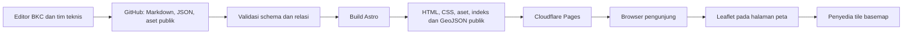

# PRD website Bumi Kala Charta

**Versi:** 0.1 · **Tanggal:** 13 September 2026 · **Status:** Draft untuk review kebutuhan

**Arah produk:** kanal resmi BKC untuk menjelaskan lembaga, mendokumentasikan pekerjaan, dan menghubungkan lokasi pekerjaan dengan publikasi pengetahuan.

**Keputusan pengguna:** menggunakan design system BKC, framework Astro, backend sederhana, serta pengelolaan portofolio dan artikel melalui berkas di GitHub dengan bantuan tim teknis.

**Rekomendasi arsitektur:** Astro dengan output statis, TypeScript, CSS dari design system BKC, Astro Content Collections, Markdown/JSON, dan Leaflet untuk WebGIS. Situs tidak memerlukan server aplikasi atau database yang berjalan terus-menerus. Konten baru terbit setelah build dan deployment berhasil.

## 1. Dasar penyusunan dan status keputusan

Dokumen ini menerjemahkan brief menjadi kebutuhan produk dan usulan implementasi. Pekerjaan saat ini terbatas pada penyusunan PRD. Arahan pembagian kerja di PPT dicatat sebagai konteks pelaksanaan mendatang, bukan instruksi untuk langsung membangun WebGIS, mengisi database, atau menerbitkan website.

| Sumber | Informasi yang dipakai | Batas penggunaan |
| --- | --- | --- |
| Permintaan pengguna dan jawaban tentang editor | Astro, design system BKC, backend sederhana, pengelolaan berkas melalui GitHub | Keputusan yang sudah ditetapkan |
| [Brief Web BKC.pptx](<D:/Project/Work/Bumi Kala Charta/Dev/Brief Web BKC.pptx>), 8 slide beserta catatan pembicara | Masalah, tujuan, dua blok MVP, WebGIS, struktur beranda, keputusan terbuka | Persyaratan produk; tidak menganggap instruksi internal sebagai otorisasi eksekusi |
| [README design system lokal](<D:/Project/Work/Bumi Kala Charta/Dev/bkc-ds/readme.md>) dan [SKILL.md](<D:/Project/Work/Bumi Kala Charta/Dev/bkc-ds/SKILL.md>) | Konteks BKC, bahasa, visual, aset, aturan penggunaan | Profil, visi, misi, statistik, nama proyek, dan orang dalam contoh belum otomatis menjadi fakta resmi |
| [Token warna](<D:/Project/Work/Bumi Kala Charta/Dev/bkc-ds/tokens/colors.css>), komponen, dan [README UI kit](<D:/Project/Work/Bumi Kala Charta/Dev/bkc-ds/ui_kits/website/README.md>) | Kesiapan teknis dan referensi komposisi | UI kit berisi prototipe dan data contoh |
| [Repositori design system](https://github.com/bumi-kala-charta/design-system) | Referensi bersama tim | Snapshot lokal menjadi dasar audit ini: commit `332eaf0dbd1addf89781dc29f6e9e794016fd4bc`, tanpa perubahan lokal saat diperiksa |

Label **brief** berarti kebutuhan dari PPT; **ditetapkan** berarti keputusan pengguna; **usulan** berarti rekomendasi PRD; **terbuka** berarti masih membutuhkan keputusan pemilik terkait. Target angka, struktur URL, pilihan Leaflet, dan hosting merupakan usulan, bukan komitmen yang sudah disepakati.

## 2. Masalah dan tujuan produk

Brief menyatakan bahwa BKC belum memiliki penjelasan resmi yang terkumpul dalam satu kanal, jangkauan pengenalannya masih bergantung pada mulut ke mulut, dan dokumentasi proyek, riset, serta kegiatan belum tersusun baik. Akibatnya, calon pembaca dan kolaborator kesulitan memahami BKC maupun menelusuri hasil pekerjaannya. Website perlu menyediakan profil yang disepakati dan bukti pekerjaan yang bisa ditemukan melalui daftar, peta, serta publikasi.

Design system mendeskripsikan BKC sebagai komunitas dan konsultansi geospasial di bidang geodesi dan geomatika, berbasis di Bandung. Ini menjadi konteks penulisan awal; rumusan kelembagaan yang ditampilkan ke publik harus ditetapkan tim BKC.

| Tujuan | Ukuran keberhasilan yang diusulkan |
| --- | --- |
| Pengunjung memahami BKC | Minimal 4 dari 5 peserta uji yang mewakili audiens dapat menjelaskan BKC dan tiga kelompok aktivitasnya setelah menjelajah maksimal 2 menit |
| Profil menjadi rujukan resmi | Definisi BKC, visi, misi, value, dan penjelasan aktivitas sudah disetujui penanggung jawab BKC sebelum rilis |
| Pekerjaan terdokumentasi dan mudah ditelusuri | Seluruh entri yang diterbitkan memiliki metadata wajib, URL detail, dan lokasi publik yang tervalidasi |
| Publikasi terhubung dengan konteks lokasi | Seluruh entri pengetahuan yang diterbitkan memiliki relasi valid ke portofolio dan titiknya di WebGIS |
| Tim dapat memperbarui konten secara konsisten | Editor teknis mampu menerbitkan satu entri menggunakan templat dan panduan dalam maksimal 30 menit, di luar penulisan konten dan review substansi |

Target uji merupakan hipotesis awal. Belum tersedia data kunjungan, baseline pemahaman publik, atau jumlah aset siap terbit untuk menetapkan target pertumbuhan yang kredibel.

## 3. Pengguna dan kebutuhan utama

| Pengguna | Kebutuhan | User story prioritas |
| --- | --- | --- |
| Publik dan mahasiswa | Mengenal BKC serta menemukan bahan belajar | Sebagai mahasiswa, saya ingin memahami kegiatan BKC dan membaca hasilnya agar dapat mempelajari penerapan geodesi dan geomatika |
| Praktisi dan peneliti | Menelusuri metode, lokasi, dan keluaran pekerjaan | Sebagai praktisi, saya ingin membuka titik pekerjaan dan publikasinya agar dapat menilai relevansi metode dan hasilnya |
| Calon kolaborator, termasuk institusi | Memahami kapasitas dan rekam kerja BKC | Sebagai calon kolaborator, saya ingin melihat portofolio, peran BKC, dan pihak yang terlibat agar dapat menentukan kecocokan kerja sama |
| Editor konten dan tim teknis BKC | Menerbitkan arsip tanpa pengisian data berulang | Sebagai editor, saya ingin menghubungkan publikasi ke ID portofolio yang sudah ada agar lokasi dan atributnya tetap konsisten |
| Pengunjung dengan keterbatasan perangkat atau akses | Mengakses informasi saat peta tidak tersedia | Sebagai pengunjung, saya ingin membaca daftar dan detail pekerjaan tanpa mengandalkan peta agar tetap dapat menemukan publikasi |

## 4. Ruang lingkup dan prioritas

### P0 — kebutuhan MVP

1. Profil lembaga: definisi BKC, visi, misi, value, dan aktivitas.
2. Portofolio proyek, riset, dan kegiatan, berikut halaman detail.
3. Informasi pihak yang pernah berkolaborasi dan perannya.
4. WebGIS titik lokasi pekerjaan dengan akses ke portofolio dan publikasi terkait.
5. Pustaka pengetahuan: paper, infografis/poster, dan esai/blog.
6. Relasi dua arah antara publikasi, portofolio, dan lokasi.
7. Pengelolaan konten melalui GitHub, validasi data saat build, dan deployment statis.
8. Tampilan responsif, navigasi yang dapat diakses, metadata SEO, dan penanganan keadaan kosong/gagal.

### P1 — pengembangan setelah MVP

| Fitur | Kriteria penerimaan bila dikerjakan | Ketergantungan |
| --- | --- | --- |
| Pencarian teks seluruh pustaka | Judul dan isi publikasi dapat ditemukan; hasil menuju URL detail; tersedia keadaan tanpa hasil | Volume konten dan kebutuhan pencarian sudah terlihat |
| Filter tahun, topik, wilayah, dan kolaborator | Filter dapat dikombinasikan, jumlah hasil akurat, dan tersedia reset | Taksonomi metadata sudah cukup konsisten |
| Pengelompokan marker saat titik padat | Setiap titik tetap dapat ditemukan melalui kelompok maupun daftar, termasuk titik yang berimpit | Hasil uji kepadatan data nyata |
| Statistik penggunaan dan event interaksi | Event tidak memuat data pribadi; tersedia definisi dan laporan agregat peta ke publikasi | Pemilihan layanan analytics dan penanggung jawabnya |
| Editor berbasis CMS ringan | Editor nonteknis dapat membuat draft dan memperoleh preview tanpa mengedit kode; tetap memakai model konten yang sama | Kebutuhan editor berubah dari keputusan GitHub saat ini |

### P2 — pertimbangan masa depan

WebGIS polygon/garis dan layer tematik, layanan data unduhan, versi Inggris, serta katalog acara mendatang dapat dikaji bila ada kebutuhan dan pengelola. Kriteria untuk membukanya: data dan pemilik tersedia, manfaat pengguna jelas, serta biaya pengelolaan sudah dinilai. PRD lanjutan perlu menetapkan perilaku detail sebelum implementasi.

### Di luar MVP

| Area | Alasan |
| --- | --- |
| Akun pengunjung, keanggotaan, forum, komentar | Tidak dibutuhkan untuk tujuan showcase dan membaca publikasi |
| Pendaftaran kelas, pembayaran, LMS, sertifikat | Contoh pelatihan dalam design system tidak menetapkan fitur transaksi dalam brief ini |
| Dashboard GIS internal, editing geometri, analisis spasial, geocoding, peta 3D | Brief meminta sebaran titik dan metadata; pengolahan GIS dilakukan sebelum publikasi |
| API bisnis, server database, CMS yang dikelola sendiri | Pengelolaan berkas dan build mencukupi kebutuhan awal yang disepakati |
| Form kontak dengan pengiriman pesan | Tidak diperlukan untuk alur inti; tautan email atau kanal resmi dapat dipakai bila datanya tersedia |

## 5. Struktur informasi dan alur pengguna

Istilah antarmuka yang diusulkan adalah **Pengetahuan**, menggantikan penulisan “knowledge based” dalam brief. **Portofolio** mencakup proyek, riset, dan kegiatan agar label “proyek” tidak mempersempit cakupan.

| Halaman | URL usulan | Isi utama |
| --- | --- | --- |
| Beranda | `/` | Identitas singkat, aktivitas, kolaborator, pengantar peta, akses publikasi |
| Tentang BKC | `/tentang/` | Profil lengkap, visi, misi, value, aktivitas, kontak resmi bila tersedia |
| Daftar portofolio | `/portofolio/` | Semua pekerjaan dengan filter proyek/riset/kegiatan |
| Detail portofolio | `/portofolio/[slug]/` | Konteks, tujuan, peran BKC, metode, hasil, kolaborator, lokasi, publikasi terkait |
| Peta pekerjaan | `/peta/` | Peta interaktif, daftar hasil, filter jenis pekerjaan, panel ringkasan |
| Daftar pengetahuan | `/pengetahuan/` | Publikasi dengan filter paper/infografis/esai |
| Detail pengetahuan | `/pengetahuan/[slug]/` | Isi atau ringkasan publikasi, penulis, tanggal, berkas/tautan sumber, relasi pekerjaan dan lokasi |
| Halaman tidak ditemukan | `/404.html` | Penjelasan singkat dan tautan kembali ke portofolio atau pengetahuan |

**Urutan beranda:** navbar sticky, hero dan tagline, tentang BKC, aktivitas proyek/riset/kegiatan, kolaborator, bagian WebGIS, lalu footer. Ini mengikuti wireframe pada slide 6. Navbar diposisikan di atas hero seperti wireframe meskipun daftar bernomor slide menyebut hero terlebih dahulu. Cuplikan publikasi setelah peta merupakan tambahan opsional jika konten siap.

Hero memuat satu CTA utama “Jelajahi peta” dan tautan sekunder “Kenali BKC”. Bagian WebGIS di beranda menampilkan pengantar, ringkasan entri yang benar-benar terbit, dan akses ke `/peta/`; peta penuh berada di halaman khusus agar beranda tetap ringan. Ringkasan profil berasal dari data yang sama dengan halaman Tentang.

**Alur utama:** beranda → peta → pilih lokasi → lihat ringkasan pekerjaan dan publikasi terkait → buka publikasi → kembali ke portofolio atau lokasi.

**Alur alternatif:** mesin pencari/tautan langsung → detail pengetahuan → portofolio terkait → “Lihat di peta”. Seluruh detail harus dapat dibuka langsung tanpa mengunjungi beranda atau menjalankan peta.

## 6. Kebutuhan fungsional dan acceptance criteria

Semua kebutuhan di bawah adalah P0. Persyaratan tambahan yang tidak eksplisit di PPT ditandai sebagai usulan operasional.

| ID | Kebutuhan | Acceptance criteria |
| --- | --- | --- |
| BKC-01 | Profil resmi dan beranda | Definisi BKC, visi, misi, value, serta tiga kelompok aktivitas tampil sesuai naskah yang disepakati. Navbar menuju halaman yang benar. Hero tidak memakai tagline yang belum disetujui pada rilis publik |
| BKC-02 | Daftar portofolio | Seluruh entri berstatus terbit tersedia sebagai HTML. Kartu memuat judul, jenis, periode, ringkasan, dan wilayah. Filter jenis memberi hasil dan jumlah yang konsisten; tanpa hasil tersedia pesan serta reset |
| BKC-03 | Detail portofolio | Memuat tujuan/konteks, peran BKC, metode atau proses, keluaran, lokasi, serta kolaborator jika ada. Tombol menuju peta memilih entri yang sesuai. Publikasi yang belum ada ditangani dengan pesan, bukan tautan kosong |
| BKC-04 | Kolaborator | Nama, logo bila tersedia, peran, serta relasinya ke pekerjaan berasal dari data yang diverifikasi. Nama teks dapat menggantikan logo. Klaim kolaborasi tidak diambil dari UI kit. Bagian beranda tidak memuat contoh atau logo tanpa dasar penggunaan |
| BKC-05 | Peta titik pekerjaan | Semua lokasi publik dari portofolio terbit muncul. Marker dapat dipilih lewat pointer maupun daftar berkeyboard. Ringkasan menunjukkan judul, jenis, wilayah, periode, tautan detail, serta daftar publikasi terkait. Atribusi basemap tetap terbaca |
| BKC-06 | Filter dan hubungan peta–daftar | Filter proyek/riset/kegiatan memperbarui marker, daftar, dan jumlah pekerjaan. Jumlah pekerjaan unik dibedakan dari jumlah lokasi. Dua pekerjaan pada koordinat sama tetap bisa dipilih melalui daftar. Pilihan tidak bergantung pada warna saja |
| BKC-07 | URL peta yang bisa dibagikan | `/peta/?portfolio=<id>&lokasi=<id>` membuka lokasi yang sesuai. Parameter kosong menampilkan seluruh data; ID yang tidak valid memberi pesan dan tampilan awal tanpa crash. Kembali ke daftar tetap memungkinkan |
| BKC-08 | Pustaka pengetahuan | Tiga format dapat diterbitkan melalui templat yang sesuai. Kartu memuat format, judul, ringkasan, tanggal, dan pekerjaan terkait. Filter format tidak menghilangkan akses ke entri yang tidak memiliki gambar sampul |
| BKC-09 | Detail publikasi sesuai format | Paper: judul, penulis, tanggal, abstrak/ringkasan, serta PDF atau tautan sumber yang sah. Infografis/poster: gambar terbaca, alt text, ringkasan teks/transkrip, dan tautan berkas bila tersedia. Esai/blog: isi HTML, penulis, tanggal, dan referensi bila digunakan. Format serta ukuran berkas lokal ditampilkan sebelum unduhan |
| BKC-10 | Relasi pengetahuan dengan lokasi | Setiap publikasi terbit memiliki satu atau lebih `portfolioIds` valid dan satu `primaryLocationId` milik salah satu portofolio tersebut. Halaman publikasi mengarah ke lokasi itu. Portofolio dan peta menampilkan publikasi terkait dari relasi yang sama, tanpa daftar manual kedua |
| BKC-11 | Publikasi melalui GitHub | Editor memakai templat berkas, preview, dan review. Build gagal bila ID/slug duplikat, metadata wajib kosong, relasi rusak, atau lokasi publik tidak valid. Draft tidak masuk HTML publik, GeoJSON, indeks, atau sitemap. Perubahan yang gagal tidak mengganti deployment yang sebelumnya berhasil |
| BKC-12 | Ketahanan dan akses | Ketika JavaScript, data peta, atau basemap gagal dimuat, daftar HTML dan halaman detail tetap tersedia. Ada pesan yang membedakan data kosong dari kegagalan teknis. Tidak ada loading tanpa batas, placeholder produksi, atau navigasi buntu |

### Perilaku WebGIS tambahan

- Tampilan awal menyesuaikan cakupan seluruh titik publik. Satu titik memakai zoom yang wajar; nol titik menampilkan keadaan kosong tanpa memperlakukan `(0, 0)` sebagai lokasi default.
- Peta menampilkan titik representatif lokasi pekerjaan. Titik bukan klaim batas area atau akurasi survei. Lokasi perkiraan diberi label yang jelas.
- Setelah filter menghapus lokasi terpilih, panel pilihan ditutup dan jumlah hasil diperbarui. Pengguna dapat mengatur ulang filter.
- Di desktop, peta berdampingan dengan daftar/panel. Di ponsel, daftar dan peta tersusun vertikal, tinggi peta dibatasi, dan halaman tetap mudah digulir.
- Interaksi peta hanya memakai zoom, pan, pilihan titik, dan filter. Tidak meminta lokasi perangkat pengguna.
- Jika tile gagal, marker yang sudah dimuat dan daftar tetap berfungsi. Jika GeoJSON gagal, tampilkan “Peta belum dapat dimuat. Telusuri pekerjaan melalui daftar.” bersama tindakan coba lagi.

## 7. Model konten dan data lokasi

**Prinsip:** metadata pekerjaan menjadi sumber utama. GeoJSON, daftar publikasi terkait, serta halaman detail dibentuk dari data tersebut ketika build. Istilah “basis data” pada slide 7 diwujudkan sebagai data terstruktur dalam berkas untuk MVP.

| Koleksi | Field utama | Aturan |
| --- | --- | --- |
| `organization` | Nama, definisi, visi, misi, value, deskripsi aktivitas, tagline, kontak, tautan sosial | Satu dokumen resmi; field inti harus disepakati sebelum rilis |
| `portfolio` | `id`, `slug`, `title`, `kind`, `summary`, periode, wilayah, peran BKC, isi, `collaboratorIds`, `locations`, `publicationStatus` | `kind`: `proyek`, `riset`, `kegiatan`; `publicationStatus`: `draft` atau `published`; ID stabil walau judul berubah |
| `locations` dalam portofolio | ID lokasi unik, label wilayah, `longitude`, `latitude`, `precision`, catatan sumber/CRS | Minimal satu lokasi publik per portofolio terbit; `precision`: `exact` atau `approximate`; hanya koordinat yang telah diizinkan untuk publik disimpan di sumber website |
| `knowledge` | `id`, `slug`, `type`, judul, ringkasan, penulis, tanggal terbit, isi/aset/URL sumber, `portfolioIds`, `primaryLocationId`, status | `type`: `paper`, `infografis`, `esai`; poster termasuk infografis dan blog termasuk esai; validasi field mengikuti format |
| `collaborators` | `id`, nama resmi, logo opsional, URL opsional, ringkasan peran | Relasi memakai ID. Data dan hak penggunaan logo diperiksa editor sebelum status terbit |
| Metadata aset | Lokasi berkas, format, dimensi/ukuran, alt text, kredit, keterangan penggunaan | Hanya aset yang siap ditampilkan publik; metadata internal sensitif disimpan di luar repo website |

Tanggal tersimpan dalam format ISO; tampilan memakai Bahasa Indonesia dan tahun yang tidak ambigu. Jika tanggal pasti tidak diketahui, model periode menggunakan tahun atau rentang tahun tanpa mengarang hari/bulan. Metrik teknis wajib memiliki satuan dan referensi yang relevan.

**Relasi:** satu portofolio memiliki satu atau lebih lokasi dan dapat memiliki banyak publikasi. Satu publikasi dapat merujuk beberapa portofolio, tetapi memilih satu lokasi utama untuk CTA peta. Publikasi tanpa konteks geografis tetap draft pada MVP sampai tim menyepakati pengecualian. Tidak membuat titik fiktif untuk memenuhi relasi.

**Aturan koordinat:** GeoJSON menggunakan koordinat geografis WGS 84 dalam urutan `[longitude, latitude]`; batas valid longitude −180 sampai 180 dan latitude −90 sampai 90. Konversi dari data sumber seperti UTM dilakukan saat persiapan data, dengan CRS sumber dicatat. Angka dalam JSON memakai titik desimal; formatter UI menggunakan format Indonesia dan label lintang/bujur yang eksplisit. Perbedaan urutan koordinat antarfungsi Leaflet ditangani di adapter data. Dasar format: [GeoJSON RFC 7946](https://www.rfc-editor.org/rfc/rfc7946.html).

GeoJSON publik hanya memuat properti yang diperlukan peta: ID portofolio/lokasi, judul, jenis, wilayah, ketelitian representasi, URL detail, dan ringkasan relasi publikasi. Data internal, koordinat sensitif, serta draft tidak disertakan. Lokasi yang perlu digeneralisasi sudah digeneralisasi sebelum masuk repo; menyembunyikan field pada UI tidak membuat berkas publik menjadi privat.

**Asumsi kapasitas awal:** hingga 300 portofolio, 1.000 titik, dan 500 publikasi. Ini adalah ukuran dataset uji untuk memeriksa kelayakan pendekatan statis, bukan jumlah aktual BKC atau klaim batas teknologi. Ukuran payload dan respons filter menjadi pemicu optimasi atau pembagian berkas.

## 8. Design system dan pengalaman visual

### Aturan yang diadopsi

| Aspek | Penerapan website |
| --- | --- |
| Warna | Hijau `#358C67` memimpin identitas. Oranye `#EA9012` menjadi satu aksen tindakan/sorotan per area; keadaan terpilih memakai hijau. Putih, paper `#EDECE9`, dan ink `#1B221E` menjadi dasar permukaan |
| Tipografi | IBM Plex Sans untuk teks/UI; IBM Plex Mono untuk koordinat, skala, satuan, dan metadata teknis. Font WOFF2 disajikan sendiri dari aset DS |
| Bentuk | Tombol pill, kartu radius 20 px, serta jarak berbasis kelipatan 4 px mengikuti token. Halaman publik maksimal 1.280 px dengan gutter responsif |
| Motif | Memakai aset kontur bawaan di belakang konten dengan intensitas rendah. Orbit menjadi motif sekunder dan tidak bercampur dengan kontur pada satu permukaan |
| Gambar | Foto kegiatan nyata milik/berizin untuk BKC. Placeholder berlabel hanya untuk draft; produksi memakai foto sah atau komposisi tanpa foto dengan kontur |
| Ikon | Lucide dibungkus komponen `Icon` BKC dengan ketebalan dan ukuran sesuai pedoman; bukan emoji atau ikon buatan bebas |
| Gerak | Singkat, maksimal 280 ms untuk transisi UI; menghormati reduced motion. Hindari animasi yang berulang otomatis |
| Bahasa | Bahasa Indonesia, kalimat singkat, sentence case, istilah teknis yang lazim. “Kami” untuk BKC; CTA berbentuk kata kerja. Tidak menyalin nama, testimoni, statistik, atau klaim dari contoh |

### Adaptasi teknis yang diperlukan

1. **Komponen DS belum berupa paket produksi Astro.** `package.json` DS berstatus private dan komponen sumber berupa React JSX. Bundle global juga membawa spesimen/UI kit. Usulan: salin snapshot token, aset, dan sumber relevan dengan catatan commit, lalu buat komponen `.astro` yang mempertahankan API visual dan aturan komponennya. Jangan memuat seluruh `_ds_bundle.js` pada website.
2. **Interaksi perlu ditranslasikan.** Contoh `Button.jsx` memakai state React untuk hover/press, sedangkan `Icon.jsx` bergantung pada `useEffect` dan `window.lucide`. Merender contoh tersebut menjadi HTML saja tidak mempertahankan semua perilaku. Gunakan CSS pseudo-class untuk state tombol dan ikon Lucide yang tersedia saat build melalui wrapper BKC. React bersifat opsional hanya bila ada komponen interaktif yang benar-benar perlu dipakai ulang.
3. **Kontras perlu diperbaiki pada lapisan semantik.** Perhitungan warna solid menghasilkan sekitar 2,47:1 untuk putih di oranye dan 4,12:1 untuk putih di hijau utama. Keduanya di bawah target 4,5:1 untuk teks ukuran normal. Usulan: ink di oranye (sekitar 6,57:1), hijau `--green-600` untuk link kecil di putih (sekitar 5,70:1), serta pasangan tombol/hover yang memenuhi kontras. Simpan penyesuaian dalam satu lapisan tema BKC yang terdokumentasi, lalu periksa setiap state, bukan mengubah hex secara tersebar.
4. **Pedoman memiliki perbedaan kecil.** README memakai sapaan “kamu” pada website, sedangkan SKILL membatasi sapaan santai ke Instagram. Usulan awal: website memakai Bahasa Indonesia yang ramah dan formal ringan, “kami”, serta CTA tanpa sapaan langsung; keputusan sapaan masuk review editorial. Contoh koordinat juga berbeda format, sehingga kontrak data dan formatter pada bagian 7 menjadi acuan website.
5. **Gunakan referensi lokal untuk rincian desain.** README lokal sudah menjelaskan glass untuk elemen di atas peta/foto/kontur; salinan GitHub yang terbaca saat audit belum memuat semua rincian yang sama. Glass bersifat opsional dan harus punya latar solid pengganti. Template dashboard berukuran tetap tidak menjadi layout website publik.

## 9. Tech stack yang direkomendasikan

| Lapisan | Pilihan | Alasan dan batas penggunaan |
| --- | --- | --- |
| Framework | Astro, output `static` | Profil, portofolio, dan publikasi menjadi HTML saat build. JavaScript dipakai untuk interaksi peta/filter saja |
| Bahasa | TypeScript dengan pemeriksaan strict | Kontrak data, filter, dan hubungan konten dapat diperiksa sebelum deploy |
| UI dan styling | Komponen `.astro`, CSS bawaan/scoped, CSS custom properties DS BKC | Memakai identitas yang sudah tersedia. Tailwind dan pustaka komponen lain tidak diperlukan untuk MVP |
| Konten | Astro Content Collections dengan schema Zod; Markdown untuk isi, JSON untuk data terstruktur | Struktur tervalidasi dan dapat ditinjau lewat Git. MDX ditambahkan hanya jika isi membutuhkan komponen interaktif |
| WebGIS | Leaflet + GeoJSON statis | Sesuai kebutuhan titik, popup, zoom, pan, dan daftar. Library diimpor hanya pada halaman peta dan setelah elemen peta tersedia |
| Basemap | Tile raster OpenStreetMap untuk pilot bertrafik rendah, dengan URL/atribusi dari konfigurasi | Perlu mengikuti kebijakan tile dan mengevaluasi penyedia lain sebelum trafik meningkat atau membutuhkan jaminan layanan |
| Ikon/font/gambar | Wrapper Icon BKC, Lucide dari dependency build, font lokal DS, optimasi gambar Astro | Aset UI tidak bergantung pada script CDN global; gambar konten memiliki dimensi dan ukuran yang sesuai |
| Hosting | Cloudflare Pages melalui integrasi GitHub | Menyajikan hasil `dist`, menyediakan preview, dan menerbitkan ulang setelah perubahan disetujui |
| Runtime pengembangan | Node.js LTS yang didukung versi Astro terpilih, npm dengan lockfile | Versi disematkan saat implementasi dan disamakan pada lokal/CI. Tidak menetapkan versi “terbaru” berdasarkan asumsi |
| Pemeriksaan | `astro check`, build, validasi relasi konten; Playwright untuk alur inti, pemeriksaan aksesibilitas dan Lighthouse | Fokus pada validitas publikasi, navigasi peta–konten, fallback, serta tampilan perangkat |
| Backend/database/CMS | Tidak ada pada MVP | Data berasal dari Git; tidak ada proses tulis dari pengunjung. Ini mengurangi kebutuhan operasi dan kredensial layanan |

Astro menyediakan koleksi dari berkas lokal dan validasi schema, serta dapat menghasilkan rute statis dari koleksi tersebut. Ini mendukung rekomendasi pengelolaan konten di atas. Lihat [Astro Content Collections](https://docs.astro.build/en/guides/content-collections/) dan [Astro Components](https://docs.astro.build/en/basics/astro-components/).

Leaflet mendukung marker, popup, dan GeoJSON tanpa mengharuskan penyedia basemap tertentu. Untuk kebutuhan titik dalam brief, ini cukup sebagai implementasi pertama. Lihat [fitur Leaflet](https://leafletjs.com/index.html) dan [panduan GeoJSON Leaflet](https://leafletjs.com/examples/geojson/). Pemilihan ini adalah penilaian atas kebutuhan BKC; dataset nyata tetap harus diuji.

Cloudflare Pages mendokumentasikan build `npm run build`, output `dist`, dan preview untuk perubahan Git. MVP yang sepenuhnya statis tidak membutuhkan adapter server, Pages Functions, atau database. Lihat [panduan deployment Astro di Cloudflare Pages](https://developers.cloudflare.com/pages/framework-guides/deploy-an-astro-site/).

**Operasional basemap:** tile standar OSM tidak memberikan SLA dan dapat membatasi penggunaan. Atribusi harus terlihat, browser harus mengirim referer yang sesuai, caching normal dihormati, serta tidak ada bulk download atau prefetch tile. Bila kebutuhan berubah, ganti penyedia melalui konfigurasi. Lihat [kebijakan tile OSM](https://operations.osmfoundation.org/policies/tiles/). Token penyedia yang memang dirancang untuk browser dibatasi domain/kuota; secret tidak pernah disertakan ke bundle publik.

**Implikasi biaya:** biaya utama yang perlu ditentukan adalah domain, penggunaan hosting/build, dan tile sesuai trafik. Tidak ada biaya server aplikasi atau database khusus pada rancangan MVP. Tidak mengasumsikan layanan gratis tanpa batas; kuota dan harga penyedia diverifikasi ketika akun dan kebutuhan trafik sudah diketahui.

### Arsitektur



Peta tidak melakukan query ke database. Browser mengambil data publik hasil build dan tile basemap. Konten yang dibaca lewat halaman detail sudah tersedia sebagai HTML. Filter dan peta merupakan peningkatan interaksi di atas konten tersebut.

### Struktur proyek yang diusulkan

```text
bkc-web-mockup/
  docs/PRD-BKC.md
  src/
    content.config.ts
    content/portfolio/        # Markdown + metadata pekerjaan/lokasi
    content/knowledge/        # Markdown + metadata publikasi
    data/organization.json
    data/collaborators.json
    components/bkc/          # Adaptasi komponen design system
    components/map/          # Peta, filter, panel, daftar
    layouts/
    pages/                   # Halaman dan output data statis
    lib/                     # Validasi relasi, pembentuk GeoJSON
    styles/                  # Tema semantik dan style halaman
    assets/                  # Gambar konten yang dioptimalkan
    vendor/bkc-ds/           # Snapshot token/aset + asal commit
  public/documents/          # Hanya berkas siap publik
  tests/                     # Alur inti dan validasi penting
  astro.config.mjs
  package.json
```

Struktur ini adalah rancangan, belum implementasi. Build harus berjalan hanya dari checkout `bkc-web-mockup` tanpa ketergantungan pada path lokal `../bkc-ds`. Snapshot DS mempertahankan referensi relatif font/pattern dan catatan lisensi/aset. Pembaruan DS dilakukan lewat perubahan terkontrol yang bisa ditinjau.

## 10. Alur editorial dan penerbitan

1. **Pemilik konten** menyiapkan naskah, bukti pekerjaan, foto/berkas yang boleh ditampilkan, pihak yang terlibat, serta lokasi yang layak dipublikasikan.
2. **Pengelola data** memeriksa koordinat dan CRS, memberi ID stabil, menormalkan jenis/periode/wilayah, serta menggeneralisasi lokasi bila diperlukan sebelum masuk repo website.
3. **Editor teknis** menambahkan berkas dari templat, memasang relasi publikasi, lalu membuka perubahan di GitHub. Data contoh tidak digunakan sebagai pengganti bahan nyata.
4. **CI** memvalidasi schema, ID, URL internal, aset wajib, koordinat, dan relasi. Preview merepresentasikan hasil build calon produksi; draft internal tidak otomatis ditampilkan. Bahan rahasia tetap berada di penyimpanan terpisah.
5. **Reviewer BKC** memeriksa substansi dan kelayakan publikasi melalui preview. **Reviewer teknis** memeriksa perilaku dan kualitas build.
6. Perubahan yang disetujui digabungkan ke branch produksi yang dipilih. Hosting membangun ulang dan menerbitkan hasil yang lolos. Editor memeriksa URL yang berubah.
7. Jika hasil produksi bermasalah, tim mengembalikan deployment terakhir yang baik atau melakukan revert perubahan lalu build ulang. Git menjadi riwayat perubahan, bukan tempat menyimpan dokumen rahasia.

**Target usulan:** pembaruan metadata/konten yang sudah disetujui tampil maksimal 10 menit setelah merge pada ukuran dataset awal. Target ini perlu dibuktikan pada hosting dan pipeline yang dipilih.

## 11. Kualitas, aksesibilitas, dan SEO

| Area | Target penerimaan |
| --- | --- |
| Responsif | Diuji pada lebar 360, 768, 1.280, dan 1.440 px. Tidak ada scroll horizontal halaman; peta tidak menghalangi navigasi, atribusi, atau pembacaan artikel |
| Aksesibilitas | Target WCAG 2.2 AA untuk alur utama: keyboard, fokus terlihat, heading semantik, skip link, label filter, alt text, dan kontras. Pilihan lokasi bisa dilakukan melalui daftar yang setara dengan peta |
| Kontras dan sentuhan | Teks normal minimal 4,5:1, teks besar minimal 3:1, serta komponen penting dapat dibedakan. Target desain tombol utama dan kontrol peta minimal 44 × 44 px |
| HTML tanpa JavaScript | Profil, daftar portofolio, daftar pengetahuan, isi detail, serta tautan publikasi terbaca. Filter dinamis boleh tidak aktif; seluruh entri tetap dapat diakses |
| Kinerja halaman | Sasaran data lapangan pada persentil 75: LCP ≤2,5 detik, INP ≤200 ms, CLS ≤0,1. Sebelum ada data lapangan, gunakan Lighthouse dan uji perangkat sebagai indikator, bukan klaim lulus Core Web Vitals |
| Anggaran beban usulan | JavaScript awal halaman nonpeta ≤50 KB gzip; library peta tidak dimuat di beranda/artikel. Indeks/GeoJSON awal ≤500 KB gzip pada dataset uji; jika terlampaui, kurangi properti atau pecah payload |
| Respons peta | Sesudah data dimuat, perubahan filter selesai ≤300 ms pada dataset uji dan perangkat acuan yang dicatat. Pengujian mencakup 1.000 titik serta koordinat berimpit |
| SEO | Title/description unik, satu H1, canonical sesuai domain final, sitemap, robots, Open Graph, URL detail stabil, internal linking, serta 404 yang benar. URL query peta memakai canonical `/peta/` |
| Metadata terstruktur | Organization pada profil, Article/CreativeWork sesuai publikasi, hanya memakai fakta dan penulis yang diverifikasi. Tidak membuat rating, alamat, atau statistik fiktif |
| Keamanan konten | Escape teks metadata/popup, batasi skema URL yang dibolehkan, dan jangan merender HTML dari data tak tepercaya tanpa sanitasi. Draft dan data internal tidak bocor ke artefak publik |
| Keandalan | Error tile/data peta tidak mematikan halaman. Berkas gagal dan URL salah memiliki pesan/tindakan pemulihan. Link eksternal diperiksa sebelum rilis dan saat kontennya diperbarui |

Acuan pemeriksaan: [WCAG 2.2 Quick Reference](https://www.w3.org/WAI/WCAG22/quickref/) dan [Core Web Vitals](https://web.dev/articles/vitals). Anggaran JavaScript, dataset, serta waktu filter merupakan target proyek yang diusulkan sendiri.

## 12. Pengukuran keberhasilan

| Jenis | Metrik dan target usulan | Metode dan waktu | Pemilik |
| --- | --- | --- | --- |
| Leading | 100% materi yang akan diterbitkan memiliki profil/metadata dan persetujuan yang diperlukan | Checklist konten sebelum rilis | PIC BKC + editor |
| Leading | Minimal 4/5 peserta menemukan satu publikasi dari lokasi pekerjaan dalam ≤3 menit tanpa bantuan | Uji tugas pada preview sebelum rilis; catat kegagalan dan hambatan | Produk/desain |
| Leading | 100% relasi publikasi–portofolio–lokasi valid; nol link internal rusak pada konten terbit | Validasi build setiap perubahan | Engineering |
| Leading | Satu pembaruan konten selesai dalam ≤30 menit di luar penulisan/review | Simulasi handover oleh editor teknis | Editor + engineering |
| Lagging | Selama 90 hari, ≥90% materi baru yang sudah disetujui masuk website dalam 7 hari kerja | Bandingkan daftar persetujuan editor dengan tanggal publikasi setiap bulan | Koordinator konten |
| Lagging | Keterpahaman BKC tetap mencapai minimal 4/5 peserta pada uji ulang hari ke-30 | Uji singkat dengan peserta baru; sampel kecil sebagai sinyal kualitatif | Produk/desain |

Kunjungan, sumber trafik, unduhan, serta klik peta ke publikasi berguna sebagai baseline bila analytics P1 diaktifkan. Event usulan: `map_portfolio_open`, `knowledge_open_from_map`, `publication_resource_click`, dan `contact_click`, dengan ID publik dan tanpa identitas pengunjung. Klik unduhan diukur sebagai klik, bukan bukti berkas selesai diunduh. Target pertumbuhan ditentukan setelah baseline 30 hari; peluncuran tidak bergantung pada pemasangan analytics.

## 13. Kesiapan konten dan keputusan terbuka

### Materi yang perlu tersedia

| Materi | Kondisi saat PRD disusun | Kebutuhan sebelum rilis |
| --- | --- | --- |
| Definisi resmi, visi, misi, value | Konteks tersedia; rumusan resmi belum diberikan. Value dinyatakan masih dibahas di brief | Naskah disepakati PIC BKC |
| Tagline hero | Belum diputuskan pada slide 8 | Satu versi final yang akurat dan cukup singkat untuk hero |
| Portofolio dan titik | Sumber belum diberikan | Usulan minimum 3 pekerjaan nyata dengan metadata dan lokasi publik valid; jenis hanya yang memang tersedia |
| Produk pengetahuan | Format sudah disebut; isi belum diberikan | Usulan minimum 3 publikasi nyata yang terhubung ke pekerjaan. Ketiga templat format harus berfungsi, meskipun koleksi awal belum memiliki semua format |
| Kolaborator | Fitur ada dalam brief; daftar resmi belum diberikan | Nama/peran terverifikasi, idealnya minimal satu kolaborasi yang boleh ditampilkan; logo opsional |
| Foto, paper, infografis | DS menyatakan foto dan banyak isi masih placeholder | Aset siap publik dan kredit. Slot foto dapat dihilangkan bila foto belum tersedia |
| Kontak dan domain | Belum diberikan | Domain final untuk canonical/deploy serta kanal resmi yang benar bila ditampilkan |

Minimum 3 pekerjaan dan 3 publikasi adalah usulan agar perjalanan peta–pengetahuan dapat dibuktikan dengan isi yang cukup. Tim dapat menyesuaikan minimum berdasarkan bahan nyata; jangan menambah entri fiktif atau memaksakan semua jenis pekerjaan tersedia.

### Pertanyaan keputusan

| ID | Keputusan | Pemilik yang diusulkan | Kapan diperlukan |
| --- | --- | --- | --- |
| Q-01 | Apa rumusan kelembagaan, visi, misi, dan value yang boleh menjadi pernyataan resmi BKC? | Pimpinan/PIC BKC | Menghambat finalisasi konten dan rilis, tidak menghambat struktur teknis |
| Q-02 | Apa tagline final untuk hero? | PIC BKC + konten | Sebelum desain hero final dan rilis |
| Q-03 | Di mana sumber portofolio, koordinat, dan metadata, serta siapa pemilik datanya? | Tim data/geospasial | Menghambat integrasi data nyata; schema awal dapat disiapkan |
| Q-04 | Lokasi mana yang boleh dipublikasikan tepat, dan mana yang perlu digeneralisasi? | Pemilik pekerjaan + tim data | Sebelum data masuk repo website |
| Q-05 | Apakah publikasi tanpa lokasi akan diizinkan pada fase selanjutnya? | Produk + konten | Tidak menghambat MVP; default MVP mengikuti relasi geografis dalam brief |
| Q-06 | Materi mana yang menjadi kumpulan rilis pertama, dan apakah minimum isi usulan sesuai? | Koordinator konten | Sebelum uji penerimaan akhir |
| Q-07 | Siapa pemilik repo, reviewer, domain/hosting, serta berapa anggaran tile bila trafik meningkat? | PIC BKC + engineering | Sebelum deployment produksi |
| Q-08 | Apakah sapaan langsung menggunakan “kamu” atau dihindari pada website? | Brand/editorial | Sebelum review copy final; default memakai CTA tanpa sapaan |
| Q-09 | Kapan target peluncuran dan siapa yang tersedia untuk tiap peran? | PIC BKC | Untuk mengubah estimasi effort menjadi jadwal kalender |

Keputusan editor GitHub sudah ditetapkan pengguna dan tidak menjadi pertanyaan terbuka. Pemilihan Cloudflare Pages, Leaflet, serta adaptasi DS tetap rekomendasi teknis dalam draft ini.

## 14. Tahapan dan perkiraan effort

Belum ada deadline dalam brief. Perkiraan berikut mengasumsikan satu pengembang yang terbiasa dengan Astro, dukungan editor dan pengelola data, serta bahan inti tersedia. Angka adalah effort implementasi, di luar produksi paper/infografis, review yang tertunda, dan perolehan izin aset.

| Tahap | Hasil | Estimasi usulan | Ketergantungan |
| --- | --- | --- | --- |
| 1. Finalisasi cakupan dan inventaris | Sitemap, schema, kumpulan konten awal, PIC, keputusan brand | 2–3 hari kerja | Review PRD dan akses ke bahan nyata |
| 2. Fondasi Astro dan desain | Layout responsif, token/aset DS, komponen utama, templat konten | 3–4 hari kerja | Sitemap dan aturan desain |
| 3. Profil, portofolio, pengetahuan | Halaman list/detail, relasi, SEO dasar, preview konten | 4–5 hari kerja | Bahan dan metadata awal |
| 4. WebGIS | Titik, panel, filter, tautan dua arah, fallback daftar | 3–5 hari kerja | Koordinat publik tervalidasi |
| 5. QA, review, dan handover | Pemeriksaan data, perangkat, aksesibilitas, deployment, panduan editor/rollback | 3–4 hari kerja | Semua kebutuhan P0 dan naskah final |

Total indikatif **15–21 hari kerja pengembangan**. Kesiapan konten dapat berjalan bersamaan dengan fondasi teknis, tetapi menentukan tanggal rilis. Pembagian peran mempertahankan area pada slide 7: WebGIS oleh pengembang, manajemen data oleh pengelola data, produk pengetahuan oleh tim konten, dengan PIC BKC sebagai penentu substansi.

### Syarat rilis

- [ ] Seluruh BKC-01 sampai BKC-12 terpenuhi dan alur peta–publikasi diuji dengan konten nyata.
- [ ] Profil, value, tagline, kumpulan konten, dan kolaborator yang ditampilkan sudah disepakati pemiliknya.
- [ ] Tidak ada data contoh, Lorem ipsum, foto placeholder, atau klaim tanpa dasar pada hasil produksi.
- [ ] Seluruh lokasi dan relasi lolos validasi; kondisi nol/satu/banyak titik serta lokasi berimpit sudah diperiksa.
- [ ] Draft, data internal, dan koordinat yang tidak layak publik tidak muncul di repo/artefak publik.
- [ ] Navigasi mobile/keyboard, kontras semua state penting, serta fallback saat JavaScript/tile/data gagal telah diperiksa.
- [ ] Build, pemeriksaan tipe, tautan internal, aset wajib, sitemap, canonical, dan 404 lolos.
- [ ] Domain, akses akun, atribusi basemap, serta konfigurasi hosting tersedia.
- [ ] Editor berhasil mensimulasikan pembaruan dan tim teknis mengetahui cara rollback.

## 15. Pemetaan kembali ke brief

| Slide | Isi brief | Bagian PRD |
| --- | --- | --- |
| 1–2 | Showcase resmi proyek, riset, kegiatan; audiens umum, mahasiswa, praktisi, kolaborator | Masalah/tujuan, pengguna, ruang lingkup |
| 3 | Tidak ada statement resmi, penyebaran terbatas, dokumentasi belum baik | Masalah dan ukuran keberhasilan |
| 4 | Profil/visi/misi/value terbit, publik memahami BKC, showcase terhubung WebGIS | Tujuan, metrik, syarat rilis |
| 5 | Profil, aktivitas, portofolio, kolaborator, WebGIS, paper/infografis/esai terikat lokasi | BKC-01 sampai BKC-10, model konten |
| 6 | Hero, navbar, About us, What we do, kolaborator, Project–WebGIS | Struktur informasi dan urutan beranda |
| 7 | Pekerjaan WebGIS, basis data, dan konten dibagi sesuai kesiapan | Alur editorial, peran, tahapan; data berbasis berkas menyesuaikan keputusan pengguna |
| 8 | Value, tagline, sumber data perlu diputuskan | Q-01 sampai Q-03 dan kesiapan konten |
